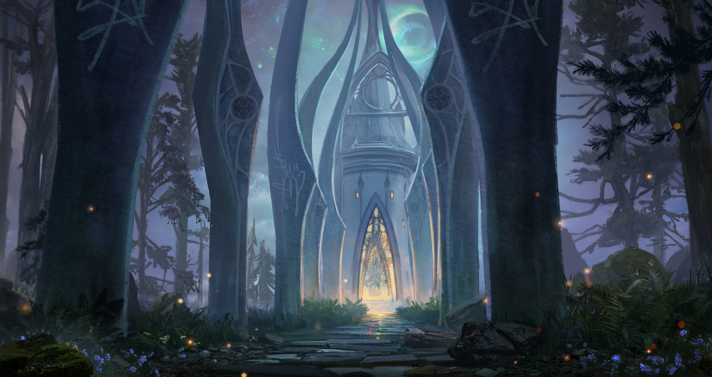
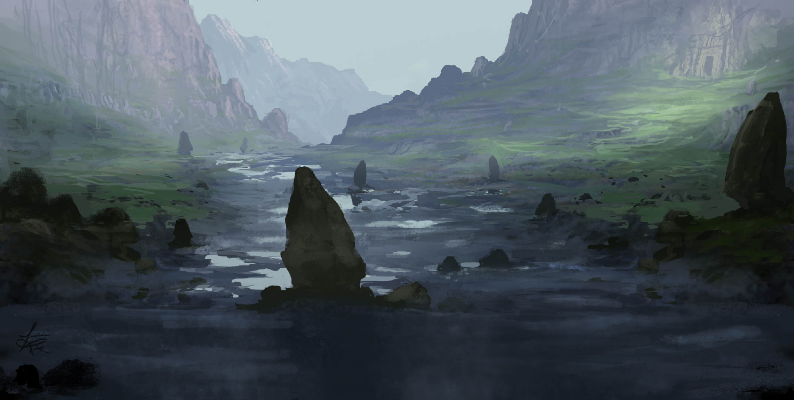

# Trouble in Paradise

# Prep

- [x]  scenario timeline
- [x]  character sheets for all NPCs
- [ ]  prep locations
- [x]  initial session notes
- [ ]  character portraits for all NPCs
- [ ]  images for all locations
- [ ]  music for all locations

# Timeline

- 1510-03-09: Worshippers of Rillifane Rallathil begin their vernal equinox fast, and will fast for a tenday.
- 3/10/1510: Skyreach Castle crashes into the Vine Vale of Evereska, oblitering several orchards and fields. 200 warriors of the Vale Guard (Scout stats) are dispatched into the Vale with an escort of 30 Lordly Wands (Mage stats) to investigate the remains of Skyreach, and the Feather Cavalry (Scouts on Griffons) are activated to patrol the Vale and report back on any potential survivors in the Greycloak hills.
- 3/10/1510: Sandesyl Morgia, having transformed into bat form and survived the fall, feeds on one of the Vale Guard at night, creating a Vampire Spawn.
- 3/11/1510: The Hill Elders convene at the Hall of the High Hunt to determine what to do with the castle. A temporary camp is established near the wreckage and artisans are called from the city to the Vine Vale to aid in the disassembly of Skyreach.
- 3/11/1510: The hoard of Glazhael is discovered inside the core berg of Skyreach, largely left intact. The Wands begin melting it down.
- 3/11/1510: Sandesyl uses the knowledge of her new Vampire Spawn to choose to establish a lair at the Garrison, where Eldreth Valuuthra sympathizers will protect her. She charms one of the Vale Guard into carrying some grave dirt to the Garrison after night falls.
- 3/12/1510: Small items scattered across the Vale implicating the Cult of the Dragon are discovered, including some of Rezmir’s personal effects.
- 3/15/1510: The Draakhorn is sounded. Animals across the vale respond to its call, and the foundations of some houses in Evereska shake.
- 3/16/1510: High Lord Erlan Duirsar contacts the elves of the High Forest to ask about the Cult of the Dragon, learning that raids have occurred there.
- 3/17/1510: High Lord Duirsar announces that the traditional hunt ritual scheduled for the equinox will be postponed due to current events.
- 3/19/1510: Worshippers of Rillifane Rallathil observe the Budding and break their fast, but do not hunt.

# Names

| male | female | family | nickname |
| --- | --- | --- | --- |
| Agaraen | Eilianther | Alaenree | Hawksong |
| Tyrael | Felaern | Immeril | Blacksheaf |
| Neithaor | Galadher | Naelgrath |  |
| Rhovanion | Amarion | Nihmedu |  |
| Tiraenion | Tauriel | Bariel |  |

# NPCs

[Rhaellen Darthammel](../../npcs/Rhaellen%20Darthammel.md) 

[Erlan Duirsar](../../npcs/Erlan%20Duirsar.md) 

[Araevin Teshurr](../../npcs/Araevin%20Teshurr.md) 

[Thia Riverwall](../../npcs/Thia%20Riverwall.md) 

[Kinyon “Trueshot” Colbathin](../../npcs/Kinyon%20“Trueshot”%20Colbathin.md) 

[Sandesyl Morgia](../../npcs/Sandesyl%20Morgia.md) 

# Locations

## Starmeadow Tower

<aside>
🎵

</aside>

### Appearance

A high tower covered in ivy and nearly a hundred feet tall. Ancient sycamore trees with roots so large they nearly block the large double doors at the base reach up nearly the full height of the tower, wrapping around it. A few high marble halls are set back into the hill, with open windows overlooking the large meadow below. The sounds of Elves laughing, talking, and sparring drift up to you on the wind, mixed with the ringing of a blacksmith’s hammer from somewhere in the trees.

### Background

Located just Southwest of the center of the city, this is the main garrison for Evereska’s armed forces. The Tomb Guard seldom return here, but the marble halls around the base host the Vale Guard and stable the Griffons of the Feather Cavalry.

### Key Info

- The lower levels of the tower have a few cells in which prisoners can be held, although they haven’t been used in centuries. The cells are formed from the roots of the Sycamore trees extending underground; no two are alike.
- A small but dedicated cell of Eldreth Valuuthra exists among the Vale Guard, mostly veterans of the second fall of Myth Drannor.

## Hall of the High Hunt

<aside>
🎵

</aside>

### Appearance

> This “hall” is really an open-air pavilion, hewn from delicate stonework and sheltered by a grove of huge shadowtop trees that have been hollowed out to form rooms off of the main atrium. At its center, a spring bubbles forth from the earth into a carved marble fountain. The air here has a sweet, clear smell like a field of wildflowers.
> 

### Background

Located just Northeast of the center of the city, this is the meeting place for the Hill Elders of Evereska:

- [Erlan Duirsar](../../npcs/Erlan%20Duirsar.md), Watcher Over the Hills
- [Kinyon “Trueshot” Colbathin](../../npcs/Kinyon%20“Trueshot”%20Colbathin.md), Tomb Master
- [Thia Riverwall](../../npcs/Thia%20Riverwall.md), High Huntress
- [Araevin Teshurr](../../npcs/Araevin%20Teshurr.md), High Mage

When the Elders are present here in times of crisis, they will be accompanied by a guard of the elite Cold Hand, who are wearing ornate Elven full plate.

It also is the home to the Singing Spring of Rillifane Rallathil, a magical fountain whose natural spring water has healing properties.

Questions for the PCs:

- Where did the castle come from? Who operated it? (Erlan)
- Why did the castle’s magic fail? (Araevin)
- How did the PCs get aboard the castle? (Thia)
- Who are the PCs working for? (Kinyon)
- Who else was aboard the castle? (Kinyon)
- What is the Black Dragon mask (Araevin, Rhaellen produces it)?
- What is Hazirawn? (Kinyon)

### Key Info

- The hall has a passage underneath it into Moondark Hill, which leads through a tunnel system out into the Vine vale. This is how the PCs are initially brought into the city.

### Developments

- If the PCs make a good impression, Araevin vouches for them and offers to put them up at the College of Magic and Arms.
- If the PCs make a middling impression, Araevin offers to put them up, but their weapons and armor will remain with Rhaellen at the Starmeadow tower.
- If the PCs make a poor impression, Araevin offers to cast *zone of truth* to allow Kinyon to subject them to more severe questioning, and they remain imprisoned in Starmeadow tower.

## College of Magic and Arms

<aside>
🎵

</aside>

### Appearance

> On either side of an open glade stand two complexes of buildings, cleverly wrought of stone and covered in vines so that they blend seamlessly into the groves of ancient sycamore and blueleaf trees that seem to be everywhere in the city. Elves in long robes come and go freely between the buildings, some lounging on the grass or speaking quietly in small groups. You can hear the musical chatter of Elvish conversation and the distant ring of steel on steel.
> 

### Key Info

- Araevin can help research the *Gatekeeper’s Crystal* at the College’s library. Each PC can make an investigation check with him, revealing the following:
    - A history of the Crown Wars mentions the Crystal being acquired by the Elven empire of Aryvandaar during the Third Crown War, circa -10,900 DR.
    - A book on *mythals* describes the total destruction of the city of Myth Ondath via the use of the *Crystal*, and an “army of the Ice Queen led by a faceless corpse”.

### Developments

## Skyreach Castle

<aside>
🎵

</aside>

> The remnants of Skyreach Castle are in bad shape. The castle’s central iceberg has been driven deep into the earth, opening a huge crater where uprooted trees and rubble are layered many feet thick. The lower courtyard has almost completely disintegrated, while the upper courtyard tilts into the sky at a crazed angle, its high towers crumbling or sheared off entirely. Debris is scattered for miles in every direction, including sheets of parchment, mangled chunks of metal, and the occasional corpse. There is a strange, lingering smell of burnt flesh and hair.
> 

### Clues

- There are no traces of Blagothkus, the dragon Glazhael, or any of the Red Wizards, but the corpses of ogres, humans, and kobolds are plentiful and not difficult to find.
- The corpses of Sandesyl’s two vampire spawn can be found in her tower, which is the only one partially standing, but it’s difficult to get up to (a DC 15 acrobatics check).
- Grave dirt can be found in Sandesyl’s coffin, until she charms some Vale Guard into moving it into the city to establish a new lair. A detailed search (DC 15 investigation) reveals that the dirt has been moved since the castle fell.
- A stray letter fragment from Rezmir’s study can be discovered amongst the debris (DC 20 investigation). It’s from Varram, who gloats that he has located a powerful artifact from the far north with the help of Old White Death (the *Draakhorn).*

### Developments

- The PCs can help by clearing debris, chipping or melting away at the castle’s ice (including the ice that encases the hoard), or sifting through the rubble.
- Anyone choosing to chip away at the hoard can roll on the DMG “Treasure Hoard: Challenge 0-4” table for each day they spend doing so (but anything recovered must be turned over to the Vale Guard).

### Enemies

- At night until the grave dirt is moved, Sandesyl Morgia is resting in her coffin in the upper tower. She flies to and from it in bat form.

### Treasure

- If the PCs favorably impress the Hill Elders, they will be allowed to keep one item each or up to 1000gp from the hoard when they leave Evereska.

# Changelog