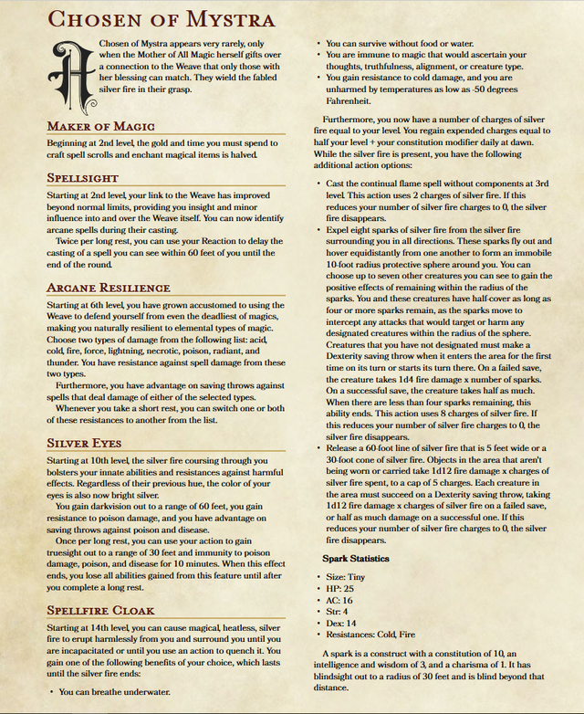

# Progression

# Plot

## Act I

- Learns about Khelben Arunsun, the first "nameless chosen"
- King Witchthorn associates Declan with Khelben in some way via prophecy

## Act II

- Learns about the existence of Eldreth Valuuthra via Dralmorrer Borngray
- Learns more about how to identify the Chosen of Mystra (Sammaster, Khelben)

## Act III

- Travels back to Cormanthor to visit [Windsong Tower](../../../Adventures/Windsong%20Tower/%21index.md)
- Learns about the circumstances surrounding the destruction of Myth Drannor
- Learns about the existence of the Watcher (Dornal) who meets with the Chosen
- At the [First Council of Waterdeep](../../../../adventures/First%20Council%20of%20Waterdeep.md), meets Sir Isteval of Cormyr, who explains about how the heir to the Cormyryean throne died in the battle for Myth Drannor and the throne is vacant

## Act IV

- Meets Dornal and learns the true circumstances of his birth
    - Dornal detects his presence because of his usage of spellsight, etc.
    - Dornal finds him to tell him that Szass Tam will have also sensed his presence; only a matter of time before he is found
    - Dornal has been told my Mystra that the last thing he must do before he can die is to pass this knowledge on to Declan. Then he will be allowed to die
- Perhaps speaks directly to Mystra, learning that he is the newest of the Chosen
- Learns why he was kept a secret, and that Szass Tam continues to search for chosen
- Confronts his half-brother Neronvain in [Neronvain](../../../../adventures/Neronvain.md)

## Act V

- Travels to Thay in [Mission to Thay](../../../../adventures/Mission%20to%20Thay.md), perhaps to the Doomvault, and perhaps meets other Chosen?
- Learns the location of the Artblade and recovers it; meanwhile Neronvain finds the Warblade

## Act VI

- Confronts his half-brother again, for the final time
- Perhaps Melandrach recognizes his claim to rule and Ilsevele returns to rule again

# Flaws

# Bonds

- Family
    - Discover the truth about his birth, including his parents.
    - Build strong enough relationships to form a family based on mutual respect.
- Leadership
    - Become a great leader like the sorcerer-kings of old.
- Magic
    - Accepting/choosing identity as a chosen?

Gains spellsight at lv6 after working with Aya

https://sorcerers.net/Worlds/FR/4.php

[https://realmofadventure.fandom.com/wiki/Dornal_Silverhand](https://realmofadventure.fandom.com/wiki/Dornal_Silverhand)

[https://www.reddit.com/r/DnDHomebrew/comments/b21oaa/chosen_of_mystra_wizard_subclass/](https://www.reddit.com/r/DnDHomebrew/comments/b21oaa/chosen_of_mystra_wizard_subclass/)