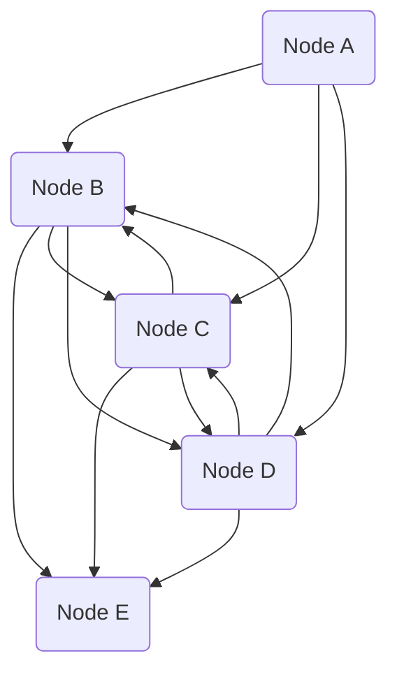

# City of Danger
## Synopsis
[http://67.82.39.229:88/DandD/5E/Campaigns/Adventurer' League/Season 2 - Elemental Evil/DDEX2 - d&d ee expeditions/DDEX2-8 Foulness Beneath Mulmaster (1-4).pdf](http://67.82.39.229:88/DandD/5E/Campaigns/Adventurer%27%20League/Season%202%20-%20Elemental%20Evil/DDEX2%20-%20d&d%20ee%20expeditions/DDEX2-8%20Foulness%20Beneath%20Mulmaster%20(1-4).pdf)

[https://forgottenrealms.fandom.com/wiki/Mulmaster?so=search&file=Mulmaster_district_Will_Doyle.jpg](https://forgottenrealms.fandom.com/wiki/Mulmaster?so=search&file=Mulmaster_district_Will_Doyle.jpg)

[https://forgottenrealms.fandom.com/wiki/The_Sword_of_Selfaril](https://forgottenrealms.fandom.com/wiki/The_Sword_of_Selfaril)

[https://forgottenrealms.fandom.com/wiki/The_Drowned_Tower](https://forgottenrealms.fandom.com/wiki/The_Drowned_Tower)

- [Thurndan Tallwand](../../Characters%20%281%29/Thurndan%20Tallwand/%21index.md) lays a trap for the gang using [Sahnd Krulek](../../Characters%20%281%29/Sahnd%20Krulek/%21index.md)
## Graph

## Nodes
### A
### B
### C
### D
### E
## Timeline
- 1510/09/09: foobar
## NPCs
- some sort of former colleague of calcey who needs the party to do a QPQ task for them (heist?) to get something
## Locations