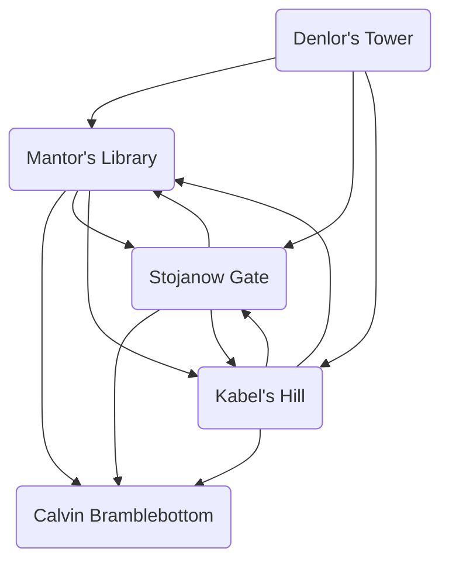

# The Cult Strikes Back, Pt. 1
## Diagram

## Nodes
### Denlor's Tower
- Puzzle
- Clue to the Lord Sage's identity
### Mantor's Library
- Lord Sage confesses his identity (why?)
- 
### Stojanow Gate Prison
- Who is here? Walharrow, Fulta, Spernik, some Black Fists who surrendered.
- Aleyd got put in charge of this place.
- Maybe there was a murder by a Zhent prison gang of one of the Cult-connected inmates.
### Kabel's Hill
### Seagull's Caw

## Revelations
- [ ] The Lord Sage of Phlan is Ranthor, half-brother to the twins Gensor and Denlor.
- [ ] Gensor is the same man who now goes by the name Thurndan Tallwand, who magically aged Calcey.
- [ ] Thurndan is currently active (how?) in Mulmaster in a way that threatens the Moonsea (a blockade?).
- [ ] Denlor kept his greatest riches in his personal chambers, which were never breached. 

## Timeline

remember that the cult always know where the PCs are, thanks to Talis taking Hagar’s hair

cult assaults Phlan to come for the Scale??
