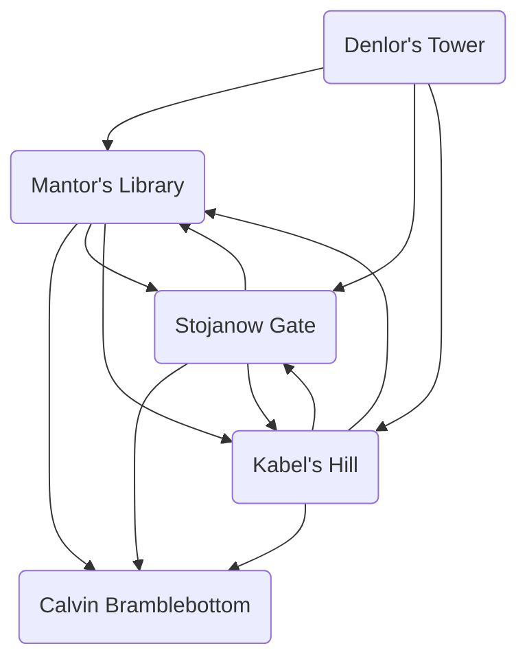

# The Cult Strikes Back, Pt. 1
## Diagram

## Revelations
1. The Lord Sage of Phlan is Ranthor, half-brother to the twins Gensor and Denlor.
2. Gensor is the same man who now goes by the name Thurndan Tallwand, who magically aged Calcey.
4. Thurndan is currently active (how?) in Mulmaster in a way that threatens the Moonsea (a blockade?).
5. Denlor kept his greatest riches in his personal chambers, which were never breached.
6. 

## Timeline

remember that the cult always know where the PCs are, thanks to Talis taking Hagar’s hair

cult assaults Phlan to come for the Scale??
