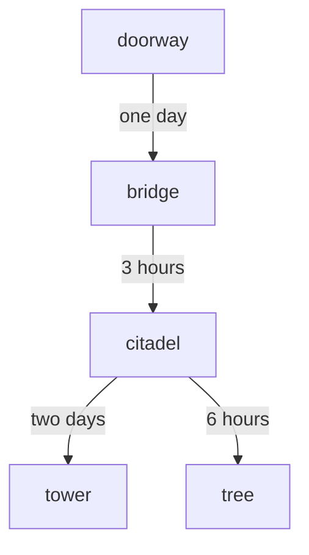

- Sildeyuir is the First Forest, the original domain of Magnar before the Star Elves imprisoned him and severed it from the world in order to inhabit it for themselves.
- Star elf mage Morthil lived among the elves of ancient Arcorar. Together they forged the Gatekeeper's Crystal, for two purposes:
  - Sealing away an ancient evil in the First Forest, and
  - Severing the Forest from the material plane, with the Star Elves as its guardians

- Technically it is a region shared between the Feywild and the Yuirwood on the Material Plane
- it was turned into a separate demiplane when magnar was imprisoned, but the spellplague rejoined it
- about 2-300 miles "end to end" coterminous with the yuirwood, but if you try to leave, it sort of bends back on itself

# vibes

- tall, silver-barked trees with very little undergrowth; phosphorescent lichen
- animals are silvery and huge, but far between and shy
- cool, unlike the humidity of aglarond
- sky is perpetually soft pearl-gray; no sun or moon but gradual illumination from horizon. at the zenith, dark purple of true night with exceptionally brilliant stars
- during "night", the purple fades to a true black
- circles of stone Menhirs (ancient elven dialect, glow under full moon, meeting places for fey)
- primacy of singing in this culture because the singers are the ones who keep the "elder evil" at bay; highest thing you can be called to be

also: ethereal marauders, ethereal filchers, ethereal slayers

# clues

1. the blight affecting sildeyuir is a manifestation of divine rage
  - when declan looks at the blight, he can see that it's not arcane in nature; it doesn't even seem to perturb the weave at all...yet it's still magical?
  - the smell of the blight fills you with frustration and anger, and when in its presence Hagar can slip into rage freely: he has to try _not_ to
  - nesterin or other star elves can explain that the blight caused his people to turn on one another until they learned to stay far away from it
1. magnar is imprisoned at rillifane's tree
  - nesterin's sister Edennil was called to join the Chorus, the greatest honor of his people. But she died during the Wakening.
  - in 1491 DR, the Chorus dealt with the Wakening, an event where the angry god seemed to suddenly stir. since then, it has been more restless in its sleep. (this was when Uzgat did the ritual with the GKC and its power went into Hagar).
  - Hagar recognizes the singing that Nesterin does as the voices he has heard in dreams, coming from the people who joined hands in the forest

1. the gatekeeper's crystal shard is at mooncrescent tower
  - 

# encounters

|d6|result|
|-|-|
|1|encounter|
|2|sign|
|3|location|
|4|exhaustion (short rest, or long if not already taken)|
|5|hunger (consume a ration)|
|6|

- one nilshai and two ethereal marauders
- four nilshai
- a herd of giant dragonflies
- abandoned star elf citadel, its walls pitted and scarred as if from acid
- blight-stricken forest that cross the path
- blight-stricken animals

# NPCs

## Nesterin

introduces himself as "Nesterin of house Deirr"
pale skin, purple irises, flowing white hair
gray cloak over silvery mithril mail and a quilted white doublet
sings to cast spells
asks a _lot_ of questions about the party

### about the nilshai

- some say they come from the ethereal plane, the spectral reality that suffuses all existence, but sildeyuir was disjoined from the ethereal plane when our mages created this domain ages ago. i cannot fathom why they would go to such lengths to bore gates here, when your domain is so much more accessible to them...

### about peregrine

- "why do you travel with a half-dragon? in histories i've read, my people spent centuries fighting against them before we retreated to sildeyuir. they are children of the Dragon Queen, made to fight in her unholy wars!"

### what he was doing

- i was to visit my cousin Leissera, at the seat of house Aerilpé, in the south, the region where the nilshai first appeared. they have always been strong there. i followed a road i thought was safe, but the nilshai had been busy since my last trip...the forests were choked with creeping blight and strange beasts. worse still, when i arrived I found the outlands of house Aerilpe empty of even a single soul. I left that place as quickly as I could, but the nilshai caught up with me on my way home...so there is my tale. A great house of our people has vanished, and my world continues to come apart at the seams.

## Lord Tessaernil

- elder brother of Nesterin's mother
- long white hair bound with a platinum circlet
- flowing robes
- Christopher Lee as Saruman-esque
- somewhat reserved, doesn't want them to go anywhere unobserved
- former Cantor of the Chorus

### Clues

- "Our home" existed prior to its severance from the Material Plane, but it was threatened by a wrathful god. Morthil imprisoned it and established the menhirs, standing stones that would restrict the passage between our realm and yours.
- 

# locations

## The Doorway

- circular clearing a hundred yards wide, flooded with bright sunlight
- droning of insects and chirping of strange, colorful birds
- lopsided old ring of moss-covered standing stones ten feet high
- central "altar" square block size of car

declan senses old magic here.

the crystal shards stir inside the bag of holding, growing warm to the touch and whitish instead of their normal irisdescent black.

anyone can make an arcana check to use the crystal as a passkey to enter sildeyuir. if you get less than 10, you still enter, but at a place far from civilization deep in the blight (where?)

### the other side

- tall, silver-barked trees with very little undergrowth; phosphorescent lichen
- cool, unlike the humidity of aglarond

describe sildeyuir's light: sky is perpetually soft pearl-gray; no sun or moon but gradual illumination from horizon (sort of like the sun had just set but was still glowing). at the zenith, dark purple of true night with exceptionally brilliant stars that are enough to throw sharp shadows of the huge trees

you realize why the crystal's signal felt faint before: this isn't the material plane, but it is connected to it. and sure enough, the signal is much clearer now.

## The Bridge

nilshai + ethereal marauders patrolling here, the nilshai uses 

## Citadel Deirr

it takes just a few hours to reach here from the Bridge (no roll needed).

- elegant tower of pale white stone, on a hill overlooking a river
- ringed by a tall, sturdy wall made of darker granite. lights flicker in the windows.
- more castle-like than home-like, but not unfriendly
- can house a hundred or more, but clearly far less than that live here.

the guards treat Nesterin with obvious deference, he explains how he met the party

## Mooncrescent Tower

it takes two days to reach here from citadel Deirr. roll on encounters table.

morthil founded an order of mages called the seneirril tathyrr; the mooncrescent order
his tomb is in the tower

## Rillifane's Tree

it takes 6 hours (one encounter roll) to reach here from citadel Deirr.

- the one hundred members of the Chorus (there are always 100) are here
- the Archcantor and ten Cantors are here guiding them in the Song
- circle of 20-ft Menhirs with a gargantuan tree that seems to distort perspective in the center
- the roots are huge, and seems to encircle some massive object, winding deep into the mossy ground

When you rouse Magnar from his slumber, roll +WIS.

- 
