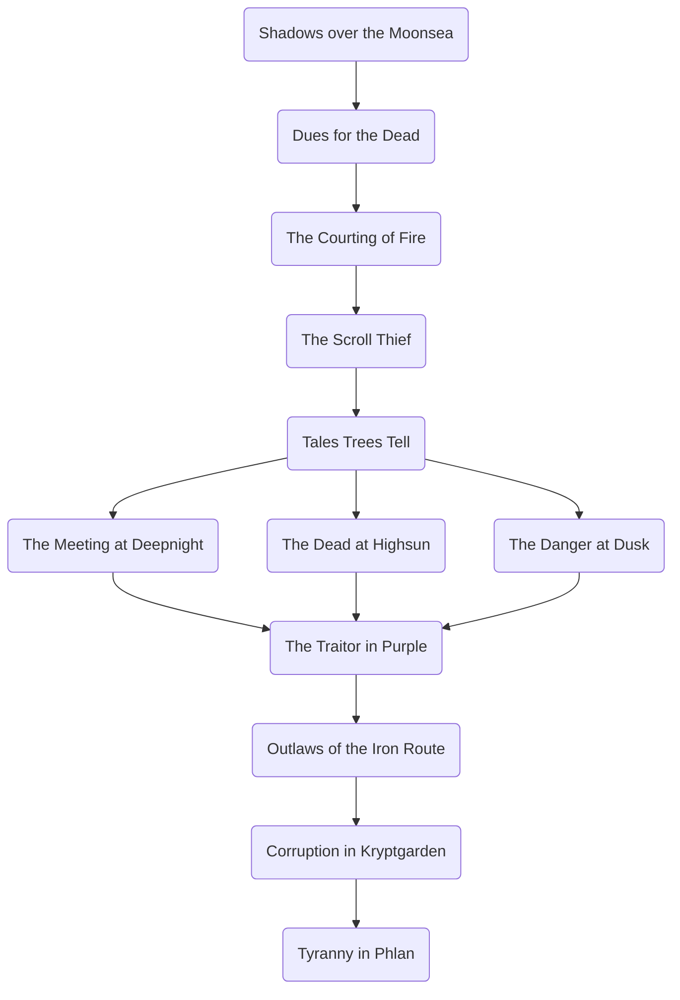

# Act I - "Moonsea"
## Overview

```mermaid
graph TD

%% nodes
id1(Shadows over the Moonsea)
id2(Dues for the Dead)
id3(The Courting of Fire)
id4(The Scroll Thief)
id5(Tales Trees Tell)
id6(The Meeting at Deepnight)
id7(The Dead at Highsun)
id8(The Danger at Dusk)
id9(The Traitor in Purple)
id10(Outlaws of the Iron Route)
id11(Corruption in Kryptgarden)
id12(Tyranny in Phlan)

%% links
id1 --> id2
id2 --> id3
id3 --> id4
id4 --> id5
id5 --> id6 & id7 & id8
id6 & id7 & id8 --> id9
id9 --> id10
id10 --> id11
id11 --> id12
```