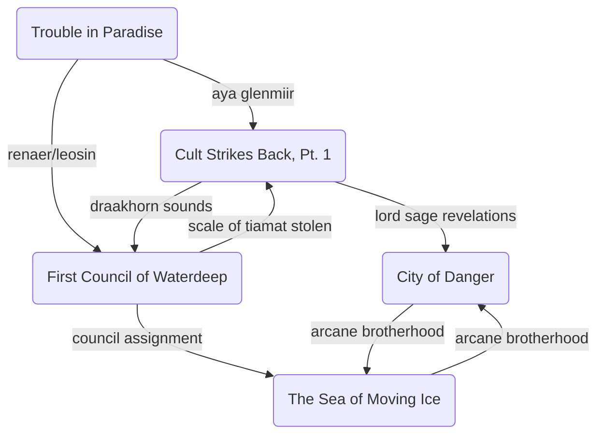

# Act III: “Revelations”
## Overview

### [Waterdeep](../adventures/first-council-of-waterdeep.md)

- The PCs meet the delegates to the First Council of Waterdeep:
    - [Davil Starsong](../../Characters%20%281%29/Davil%20Starsong/%21index.md), who is acting as an aide to Dagult and isn’t explicitly acknowledged as [zhentarim](../factions/zhentarim.md) (travels with Ziraj as bodyguard)
    - [Ontharr Frume](../../Characters%20%281%29/Ontharr%20Frume.md), representing the [order-of-the-gauntlet](../factions/order-of-the-gauntlet.md)
    - [Remallia Haventree](../../Characters%20%281%29/Remallia%20Haventree/%21index.md), representing the [harpers](../factions/harpers.md) (and maybe Renaer)
    - Sir Isteval (Cormyr), Ahash Al-Mandi (Calimshan), etc. representing the [lords-alliance](../factions/lords-alliance.md) (see adventure)
- Clue leading to the Sea of Moving Ice

### [Sea of Moving Ice]

- [Hagar Bloodrop](../../Characters%20%281%29/Hagar%20Bloodrop/%21index.md) can have an audience with Bonecarver, the shaman who practices totem magic
- Maccath the Crimson can explain things about the Arcane Brotherhood, and about [Thurndan Tallwand](../../Characters%20%281%29/Thurndan%20Tallwand/%21index.md) and maybe [Eryn](../../Characters%20%281%29/Eryn/%21index.md)

# Revelations

- [ ] [Declan Truefire](../../Characters%20%281%29/Declan%20Truefire/%21index.md) is one of Mystra’s Chosen
- [ ] The Chosen have been disappearing and few are left on Faerun
- [ ] A great battle was fought and Myth Drannor fell in the recent past, leaving the throne of Cormyr vacant
- [x] The Great Spirit Magnar lives, and is trying to get [Hagar Bloodrop](../../Characters%20%281%29/Hagar%20Bloodrop/%21index.md)’s help because it is oppressed in some way
- [x] The sound heard across Faerun was produced by the Draakhorn, an ancient artifact last known to be in the Sea of Moving Ice
- [x] Talis the White has been promoted to Wyrmspeaker and continues to observe the characters via *scrying*
- [x] [Thurndan Tallwand](../../Characters%20%281%29/Thurndan%20Tallwand/%21index.md) has one of the shards of the Gatekeeper’s Crystal
- [x] [Eryn](../../Characters%20%281%29/Eryn/%21index.md) was an assistant to [Thurndan Tallwand](../../Characters%20%281%29/Thurndan%20Tallwand/%21index.md), imprisoned because she discovered he had been possessed by Tyranthraxus
- [ ] [Sahnd Krulek](../../Characters%20%281%29/Sahnd%20Krulek/%21index.md) serves as right-hand man to [Thurndan Tallwand](../../Characters%20%281%29/Thurndan%20Tallwand/%21index.md), believing his power will put an end to corruption across the Moonsea

# TaleSpire Maps

- *Frostskimmr* generic battlemap? ([https://talestavern.com/slab/small-viking-ship/](https://talestavern.com/slab/small-viking-ship/), [https://talestavern.com/slab/sea-of-moving-ice-encounters-tyranny-of-dragons/](https://talestavern.com/slab/sea-of-moving-ice-encounters-tyranny-of-dragons/))
- Oyaviggaton / Ice Hunter village
- Tower of Arcane Might (Thurndan’s Lair)
- Denlor’s Tower

# Events
