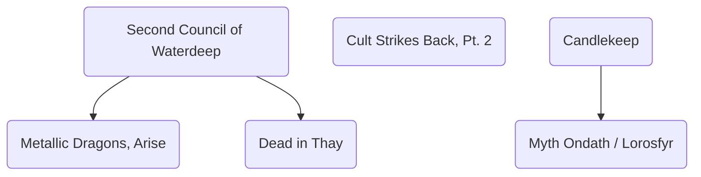

# Act IV - "Enemy of My Enemy"
## Overview

```mermaid
graph TD

%% nodes
id1(Second Council of Waterdeep)
id2(Cult Strikes Back, Pt. 2)
id3(Metallic Dragons, Arise)
id4(Dead in Thay)
id5(Myth Ondath / Lorosfyr)
id6(Candlekeep)

%% links
id1 --> id3
id1 --> id4
id6 --> id5
```