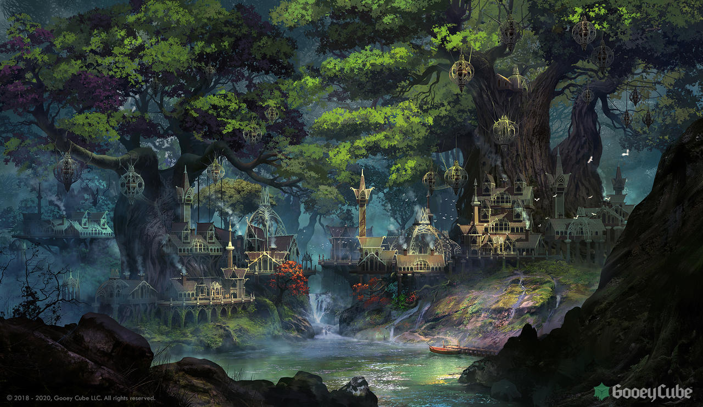

# College of Magic
## Appearance

> On either side of an open glade stand two complexes of buildings, cleverly wrought of stone and covered in vines so that they blend seamlessly into the groves of ancient sycamore and blueleaf trees that seem to be everywhere in the city. Elves in long robes come and go freely between the buildings, some lounging on the grass or speaking quietly in small groups. You can hear the musical chatter of Elvish conversation and the distant ring of steel on steel.

## Background

## Areas
### Great Hall
The great hall has doors of blueleaf wood bound with mithral, and a dome of mithral and theurglass on top. Its lower floor serves as a meeting place and mess hall for students of both colleges, while the upper floor was used for meetings of the faculty.
### Conservatory
The conservatory has high ceilings, an oak floor, and paneled walls of cherry, carved with scenes of sylvan creatures. It is used as both a Bardic recital hall and a lecture hall for students of the College of Magic.
### Vaults
The vaults of the College contain many rare and precious artifacts and magical devices. Some vaults were deep in the earth, but others existed only in extradimensional spaces. The most valuable and dangerous items were stored in vaults protected by lethal traps.
### Archmage's Quarters
[araevin-teshurr](../../npcs/araevin-teshurr.md)'s office has a theurglass-plate window overlooking the Shaeradim and a large fireplace and desk, along with a small reverie couch.