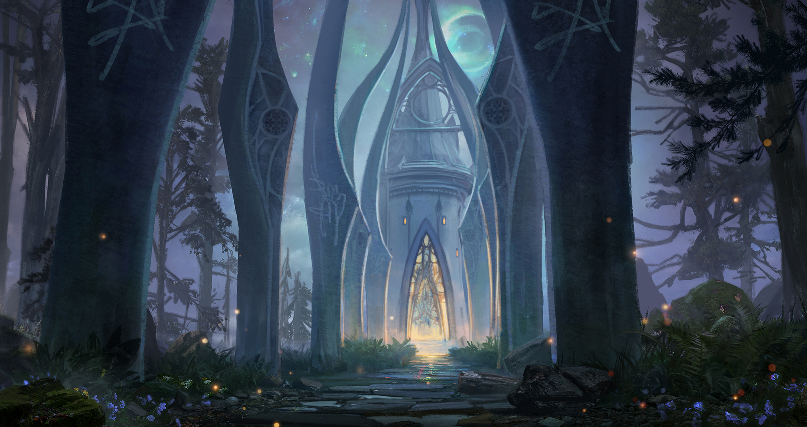

# Hall of the High Hunt
## Appearance

> This “hall” is really an open-air pavilion, hewn from delicate stonework and sheltered by a grove of huge shadowtop trees that have been hollowed out to form rooms off of the main atrium. At its center, a spring bubbles forth from the earth into a carved marble fountain. The air here has a sweet, clear smell like a field of wildflowers.
> 

## Background

Located just Northeast of the center of the city, this is the meeting place for the Hill Elders of Evereska:

- [erlan-duirsar](../../npcs/erlan-duirsar.md), Watcher Over the Hills
- [kinyon-colbathin](../../npcs/kinyon-colbathin.md), Tomb Master
- [thia-riverwall](../../npcs/thia-riverwall.md), High Huntress
- [araevin-teshurr](../../npcs/araevin-teshurr.md), High Mage

When the Elders are present here in times of crisis, they will be accompanied by a guard of the elite Cold Hand, who are wearing ornate Elven full plate.

## Areas
### Singing Spring of Rillifane Rallathil
a magical fountain whose natural spring water has healing properties, located in the center of the pavilion.