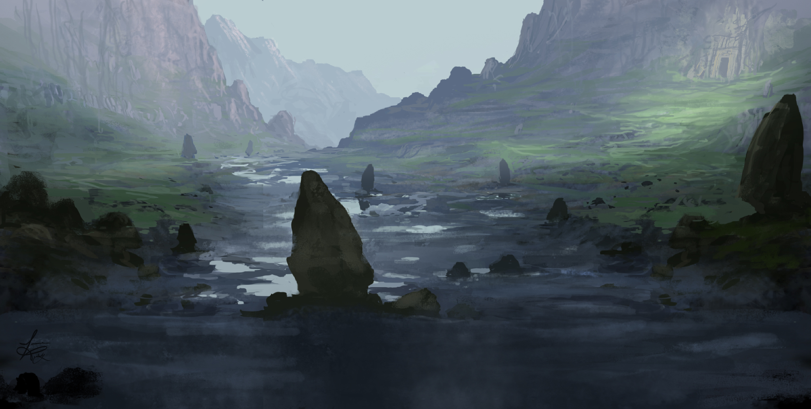

# Skyreach Castle Wreck
## Appearance

> The remnants of Skyreach Castle are in bad shape. The castle’s central iceberg has been driven deep into the earth, opening a huge crater where uprooted trees and rubble are layered many feet thick. The lower courtyard has almost completely disintegrated, while the upper courtyard tilts into the sky at a crazed angle, its high towers crumbling or sheared off entirely. Debris is scattered for miles in every direction, including chunks of ice, mangled bits of metal, and the occasional corpse. There is a strange, lingering smell of burnt flesh and hair.
## Background
On Ches 10, 1510, the cloud giant Blagothkus lost control of Skyreach Castle, leading to its crash landing in the Vine Vale of Evereska. The castle is severely damaged and has caused widespread destruction at its landing site, but some items and clues can be retrieved from the wreckage.
## Areas
### Lower Deck
The lower deck largely disintegrated upon impacting the earth. Due to the castle's tilt, most anything towards the "front" of the castle is now completely gone, but some of the rooms towards the "back" (close to the core berg) are preserved since they did not directly impact the ground.
#### Red Wizard's Quarters
- A scroll of *dimension door* survived the crash (DC 20 investigation to find).
- The giant book "Beyond the Iron Gates" fell off of its lectern and has been damaged. Written entirely in Infernal, its final chapters describe the usage of mass sacrifice to bring large entities out of the Nine Hells and onto the material plane.
#### Wyrmspeaker's Quarters
- Almost everything inside this chamber burned when the lit brazier overturned. It stinks of smoke and charred flesh.
- A stray letter fragment from can be discovered amongst the debris (DC 20 investigation). It’s from Varram, who gloats that he has located a powerful artifact from the far north with the help of Old White Death (the *Draakhorn).*
#### Stone Giant's Quarters
- The stone giant's chest is largely intact. It's a six foot by four foot, 500-lb iron chest. One side has been dented and it requires a DC 15 Strength check to open. The *globe of force* inside can be deactivated with an *antimagic shell* or *dispel magic* (DC 16). There are 32 small but perfect gemstones inside totalling 16,000gp (500 gp each) and a set of massive masonry tools.
- The mangled bodies of the two giants are slumped in the lower corner. Hulda is extending her arms as if to protect Wiglof and cushion him from a fall.
### Upper Deck
The towers of the Upper Deck are tilted at a 30-degree angle to the ground, and some are severely damaged. Everything on this deck slid towards the "front" of the castle and is collected around the edge, including many corpses of Ogres, humans, and kobolds.
#### Sandesyl's Tower
- The upper portion of this 100-foot tower has exploded, and the bottom part leans dangerously. It now reaches about 75 feet up to the balcony where Sandesyl's coffin originally rested.
- The corpses of Sandesyl’s two vampire spawn can be found up on the balcony. Closer investigation (DC 15 investigation) reveals they seem to have taken up positions that would have prevented the coffin from overturning.
- Grave dirt can be found in Sandesyl’s coffin, until she charms some Vale Guard into moving it into the city to establish a new lair. A detailed search (DC 15 investigation) reveals that the dirt has been moved since the castle fell.
#### Esclarotta's Tower
- This tower is intact and tilted at a 30-degree angle, but smashed corpses of several ogres litter the ground around it. A coil of rope hangs down from the upper reaches of the tower to stop about 20 feet off the ground.
- The magic in this tower has ceased to function, so it's just a hollow cylinder about 90 feet long.
#### Steering Tower
- There are no traces of Blagothkus. The massive *arcane lock*ed ice door still holds, but the top of this tower has sheared off, revealing the gems embedded in the walls and the huge steering apparatus wrought of copper and gold.
### Core
#### Main Vault
- The entrance to the vault from the lower deck was compacted when the force of the upper deck hit the ground, crunching up the inside of the tunnels. It's now a tight enough passage that a Small-sized creature could squeeze through, but it's not clear how deep the passage goes.
- Any Small creature that follows the passage and succeeds at a DC 15 acrobatics check can make it into the Main Vault, which is largely intact. There are huge icicles the size of cars here, many of which broke off and shattered when the castle crashed. The vault is split into two levels, with an upper level that overlooks a sunken level 30 ft. below.
- The treasure hoard is frozen in ice. Melting it requires many fire spells or a long wait with a reliable fire source, but a single character can spend the day chipping away at the ice and roll once on the DMG "Treasure Hoard: Challenge 0-4" table.