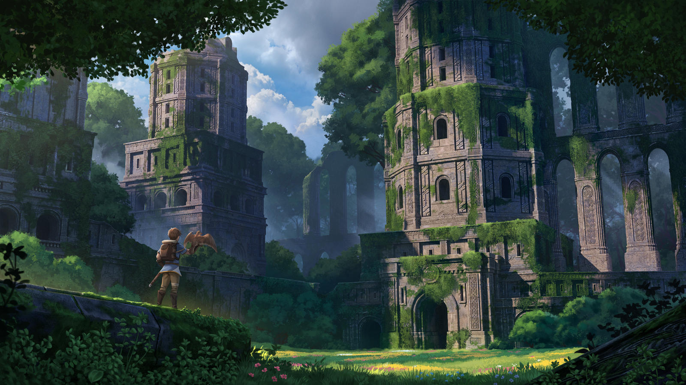

# Starmeadow Tower
## Appearance

> A high tower covered in ivy and nearly a hundred feet tall. Ancient sycamore trees with roots so large they nearly block the large double doors at the base reach up nearly the full height of the tower, wrapping around it. A few high marble halls are set back into the hill, with open windows overlooking the large meadow below. The sounds of Elves laughing, talking, and sparring drift up to you on the wind, mixed with the ringing of a blacksmith’s hammer from somewhere in the trees.
## Background
Located just Southwest of the center of the city, this is the main garrison for Evereska’s armed forces. The Tomb Guard seldom return here, but the marble halls around the base host the Vale Guard and stable the Griffons of the Feather Cavalry.

## Areas
### Brig
The lower levels of the tower have a few cells in which prisoners can be held, although they haven’t been used in centuries. The cells are formed from the roots of the Sycamore trees extending underground; no two are alike.

