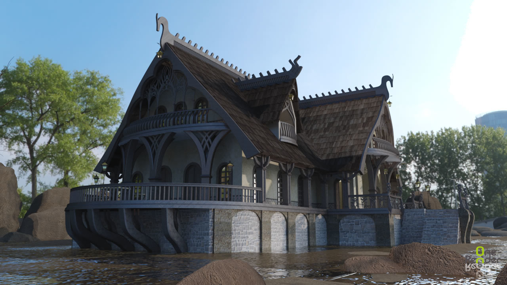

# The Unicorn and Crescent Inn
## Appearance

> A grand two-story building with sweeping balconies and flourishes of elvish design, incorporating the moon and stars into its woodwork. Aging but well-kept, and nearly empty most of the time.
## Background
- Built in 1022 DR when the [Harpers](../../articles/factions/harpers.md) were short on allies, having killed Sammaster and attracted negative attention from Thay.
- First owned by Phaerl Hawksong, a senior priestess of Rillifane who was also the half-sister of Khelben Arunson and later member of his Moonstars.
- Open continuously for almost 500 years, with an original mission of providing a bed and a meal for any or Chosen of the Lady of Mysteries, longtime friends of the Elves.
- For the last hundred years or so, mostly serves as a "college bar" for students at the College of Magic, including many of [Araevin Teshurr](../../npcs/araevin-teshurr.md)'s students.
- The current steward is Mithriel "Mith" Summergale, Araevin's advisee. He refused to educate her in High Magic unless she took the job, which is annoying but has its benefits.
## Areas
### Kitchen
- The kitchen is operated on a fairly haphazard co-op basis: whoever needs supplies to cook brings them and leaves them for the next cook. As such, it's full of all sorts of random ingredients.
- There are several casks of Evereskan Clearwater here, a spirit highly prized elsewhere in the Realms that is an incredibly potent Elvish moonshine. It's made with water from the Singing Spring of Rillifane Rallathil in the [Hall of the High Hunt](hall-of-the-high-hunt.md).
### Common Room
- The lower floor features beautiful round tables of shadowtop wood inlaid with mother-of-pearl depicting scenes of unicorns in wooded glades. They're very worn from generations of student drinkers.
### Bedrooms
- The upper floor of the Inn is divided into ten guest rooms, each of which has a bed that can sleep two medium-sized creatures. The sheets haven't been changed in years.
- Now used mostly as study rooms and private quarters for students, or places to sober up for those who overindulge.
### Garden
- The garden plot next to the inn is a secluded area, with walls covered in ivy. It contains a small shrine to Mystra, an ancient stone pedestal with her sunburst holy symbol.
- Students come here to leave small offerings as tokens of luck prior to their exams. At the moment, a few rings, paper charms, and flowers are on the altar.