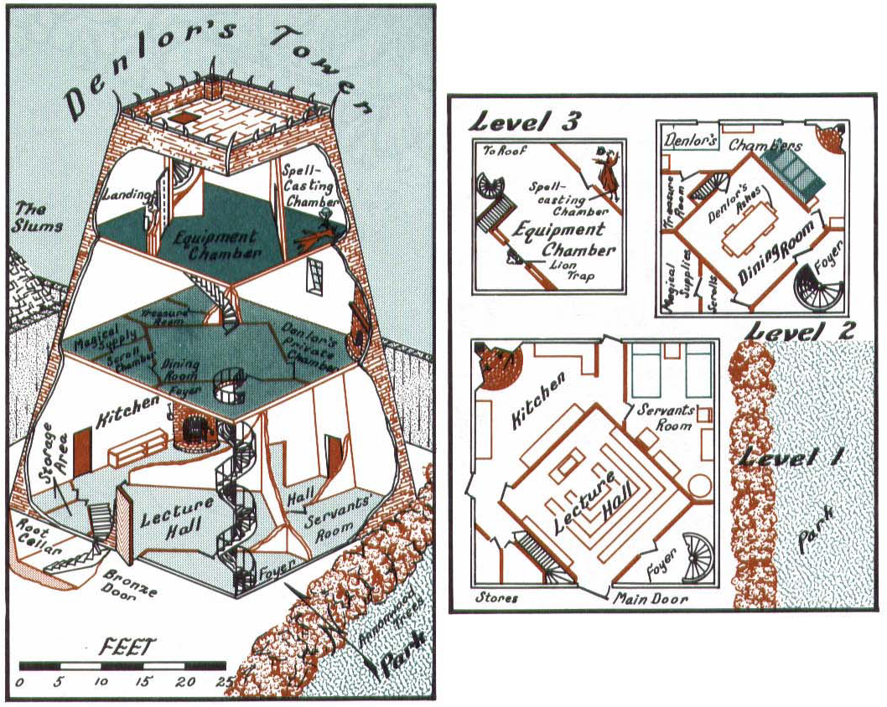

# Denlor's Tower

Created: March 21, 2021 10:12 AM

items stored in storeroom by hagar:

- club, dagger, greataxe, greatsword, scimitar, warhammer

items from peregrine:

- buckler, 9 pints of oil, 6 rations

# First floor

The Lord Sage recounts how Shal's familiar Cerulean absorbed the magical energy of the barrier that affected the bronze door in front, allowing Ren's gang to enter that way, but doesn't recommend that the gang try the same. He also mentions that as both Denlor and Ranthor likely met their ends here, any room not locked or trapped was likely looted by the forces of darkness. However, many magical wards would have gone into effect once Denlor died.

**Kitchen**

Describe the massive kitchen and its huge brick oven. Porcelain dishware is shattered in places on the floor, and metal cooking utensils are cast about. Calcey could cook a meal for a large group here, if it was in better shape.

**Pantry**

No door to this room. This small room contains only empty burlap sacks and other containers, having been long-ago ransacked by the invading forces of evil.

**Storeroom**

The simple wooden door is open. This room contains the shattered remnants of wooden pallets used to hold ingredients, and an empty barrel.

**Root cellar**

The simple wooden door is locked; DC 12 to pick. Dusty bottles of Haerlu wine (from Halruaa) and a few hanging shanks of meat, dried away to nothing.

**Lecture hall**

This diamond-shaped room with a marble floor has three rows of simple wooden benches arranged in a U shape facing a broad, low lectern. Many of the benches are broken or overturned, and the lectern has been pushed back towards the far wall, judging from tracks in the dust.

**Servant's room**

The simple wooden door is open. This room contains simple quarters for servants or apprentices who might have lived with Denlor, including two beds, simple chests of drawers, and a small table and chairs. The chests are empty, their drawers pulled out crazily at odd angles. The faded sheets on the beds have been ripped and pulled apart.

### Second floor

**Dining room**

The PCs emerge into a large marble-floored dining room, with a table that could comfortably seat six. All the chairs in the room are broken, and a fine wooden dust coats the top of the table. A closer inspection reveals ancient bloodstains on much of the furniture, and piles of ashes all over the room.

The Lord Sage mentions that it is likely in this room that Denlor died, and the wizard Shal had recovered his ashes when she searched the room. He also says that all the doors leaving this room save the one to the North were trapped, and that they want only to continue going upwards.

**Denlor's chambers**

Protected by a *glyph of warding*: opening the door creates a 20ft radius of magical flame from a painting of an ifrit on the door's face, DC 17 dex saving throw or take 8d8 fire damage, save for half damage. Requires a DC 26 arcana check/dispel magic to disable. The trap can also be avoided by 

This room has a large, comfortable couch that can seat up to 4 medium-sized creatures opposite a brick hearth. Its East-facing window looks out across the river Stojanow into New Phlan, towards the rising sun. A large bed is made with silken sheets. If night, the room is lit by a single driftglobe, which activates on its own when first entered.

Denlor's chest of drawers contains:

- A set of thick wool robes, with arcane calligraphic designs in red and gold velvet on the outer face.
- A set of lighter wool underclothes
- A box of candles and a small tinderbox
- A fine metal hip flask with a scene depicting a kraken destroying a ship etched on it
- A ring of keys that can lock each of the non-magically-trapped doors in the tower, as well as the chest in the treasure room.

**Treasure room**

Only reachable from Denlor's chambers. Door is locked, DC 20 to pick. Has an armor rack and weapon rack, as well as a large locked oak chest (also DC 20).

Contains:

- A set of elven chain, on the armor rack.
- A *wand of the war mage +1,* on the weapon rack. Made of yew, with a design of curling flames carved into the lower half.
- A *flame tongue* short sword with a ruby ringed by a gold sunburst set in the hilt and a pattern of alternating diamonds etched into the blade. Its command word (and its name) is *mutaghayir,* "harlequin" in the Jannti language of the genies.
- A *ioun stone of awareness*, in the chest.
- Three *potions of healing*, in the chest.
- A *potion of fire breath*, in the chest.
- A *potion of fire resistance*, in the chest.

**Scroll chamber**

Protected by a "Shrine of Law" trap: any chaotic creatures who touch the door make a DC 18 wisdom saving throw or take 8d8 damage and are stunned for 1 round, half damage on a successful save. DC 15 to find and DC 22 Arcana to disable.

This room has a few scrolls (and many empty cases) sorted into large bins:

- A scroll of *burning hands*
- A scroll of *chromatic orb*
- A scroll of *earth tremor*
- A scroll of *witch bolt*
- A scroll of *immolation*

**Magical supply**

Locked, DC 20 to pick. Only reachable from scroll chamber. Endless cabinets with drawers ranging from a few inches to a few feet wide, containing all manner of material spell components. The vast majority of non-consumable spell components can be found here.

### Third floor

**Landing**

This is what the Lord Sage is most unsure of. There were magical wards on this door, in addition to the Lion lock. His hope is that Shal simply left the wards alone after she "keyed them in", and all they need to do is operate the Lion in the same way. The wards are no longer active, but the lion still is.

To unlock the door, one needs to reach into the lion's mouth and visualize the room beyond. If an image of the room isn't held in the mind, the door unlocks, but on the other side is the lecture hall on first floor. When the Lion is unlocked, the door separates in half and slides into the adjacent walls. It closes automatically when no creature is within 5 feet.

If the PCs struggle with this, the Lord Sage mentions that Shal was the only one able to open this door. It wasn't explained why in Ren's memoirs, but the Lord Sage thinks it had less to do with her magical ability and more to do with something she knew, since Cerulean couldn't operate this door and neither could the rest of the gang.

**Equipment chamber**

A single driftglobe lights this chamber and the one beyond, which blinks and flares to life when the PCs enter.

A 10-foot-wide permanent teleportation circle is inscribed into the marble floor of this chamber, which is inlaid with gemstones. The arcane glyphs around its ring are inlaid electrum, shining dimly in the light. The Lord Sage tells the PCs to commit it to memory, for it is theirs to use - "with the utmost caution". He explains that Aya has a trusted contact in Waterdeep who can send them back to the circle using a spell, if he is provided with the coordinates.

**Spellcasting chamber**

The wooden door to this room has been smashed in by a huge force, and wooden splinters litter the floor, some of them shining eerily green in the light. Beyond, the twisted metal wreck of a standing crystal ball is visible, its crystal nowhere to be seen. Parts of this room are blackened and burned, and a hole in the wall on the North side looks out into the frigid night air.

The Lord Sage explains that Ranthor made his last stand here against the same enemies who slew Denlor, and that Shal rescued his body when the first gang came into the building.

### Roof

The roof is simple wooden planks, with a commanding view in all directions except West, where the old city walls rise about to eye level. Twisted metal spikes jut out in all directions, some of them warped and curled as if by a great melting heat.