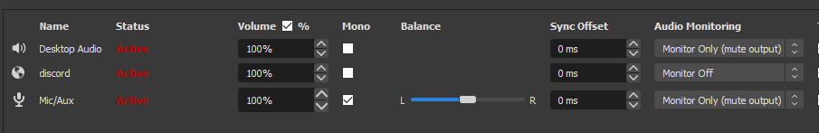

# Streaming

# Camera Controls

1. Turn on the iPad and connect using spacedesk. (Do this before starting OBS!)
2. Fire up TTS. It should automatically use the iPad as the spectator screen. Run at 1024x768 resolution to ensure that your view matches the spectator's view.
3. Change to the black player color so that fog of war, etc. will not affect you.
4. By default, the view tracks yours. To disable this, push right control/command.
5. You can set preset camera locations using ctrl + 1, 2, or 3.
6. To move your camera to those locations, use shift + the same number.
7. To move just the spectator camera to those locations, push shift to cycle through them.

# Tasks

- [x]  Remove monitors from desk
- [x]  Add desktop back to top of desk
- [x]  Goodwill stuff under desk October 14, 2020 5:00 PM (EDT)
- [x]  Install OBS
- [x]  Install OBS discord streamkit overlay
- [x]  Test composited webcam over background video
- [x]  Create a stream background frame
- [x]  Try using TTS [spectator mode](https://steamcommunity.com/sharedfiles/filedetails/?id=1925496116)
- [x]  Try streaming TTS and [importing HeroForge models](https://www.reddit.com/r/tabletopsimulator/comments/cslp17/hero_forge_advice_for_minis/)
- [ ]  Try hanging a sheet for chroma key
- [ ]  Try [painting a HeroForge model in Blender](https://www.youtube.com/watch?v=6fCHAcL8iZ4&feature=youtu.behttps://www.youtube.com/watch?v=6fCHAcL8iZ4&feature=youtu.be)
- [ ]  Try [using an updated process](https://www.youtube.com/watch?time_continue=319&v=sXvNsqp_Cr8&feature=emb_logo) to make models into AssetBundles
- [ ]  Try out the BarKeep health bar mod

# Audio settings

[old-audio-settings](old-audio-settings.md)

MOTU interface needs to be on and plugged into desktop

use MOTU interface’s phones

## Discord

input device: stereo mix (realtek)

output device: motu phones

## OBS

desktop audio set as MOTU Analog

mic audio set as MOTU Mic/Instrument

monitoring device set as “default”

sidechain compressors set on desktop audio for both mic and discord

## Windows

main output set as speakers (realtek)

main input set as microphone (realtek)

windows media player output set as MOTU analog (corresponds to desktop audio)