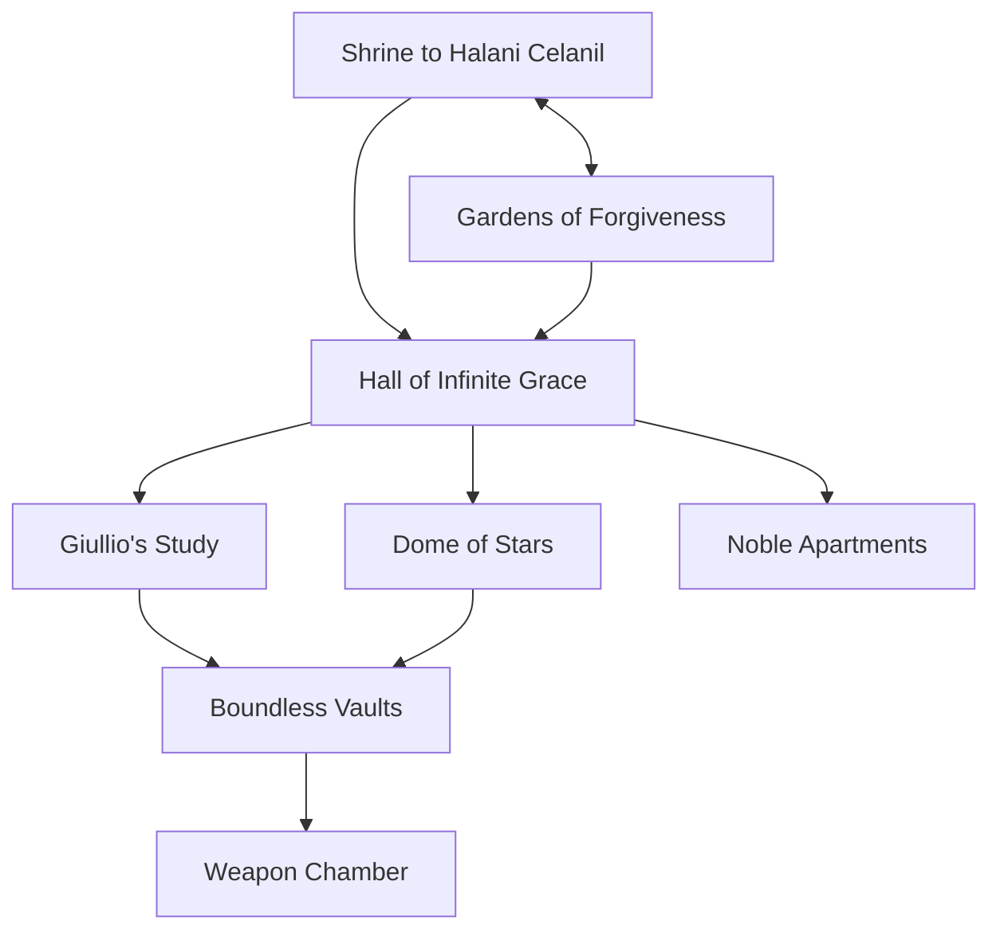

# todo

# warmup

Suggest a minor complication (something you would complain about) for another character.

# recap

- calcey plays dumb when noticed by the sentry and decides to use her newfound elvish proficiency to get invited to dinner with the Veldann soldiers.
- the durothil soldiers leave in disgust, noticing that a sentry had been hidden in the tree, stating that they'll pick this back up later and will be the first to the sword no matter what.
- two dinner scenes: declan, araevin, and ilsevele share a family meal while Calcey busts out the brandy and the rest of the gang schmoozes with the elven soldiers, language barrier or no.
- Araevin decides to tell the story of how he came to be involved in the Crusade, the Elven march to Faerun that was led by Ilsevele's father against the daemonfey. Though he sought the Gatekeeper's Crystal with his adventuring party, the company of the white star, they failed to find it in time and the Daemonfey were released from their ancient prison.
- Ilsevele decides to recount her memory of adventuring alongside Araevin: how she joined him at first, but left to be at her father's side after their cleric Grayth was killed in an ambush and Araevin fell into a trap set by the Daemonfey intended to kill him; the loregem that instead turned him into a half-celestial being. The only reason he didn't die is because he turned out to have some daemonfey blood himself.
- Later that night, Declan and Ilsevele are awake by firelight. Ilsevele admits that, seeing that her fiancee was increasingly lost to her, Ilsevele broke off the engagement and ended up with her bodyguard, Starbrow. But she never understood her father's rationale in bring Starbrow back from Arvandor, and when he begged her to return to his former wife and children, she finally relented.
- The rest of the gang ply the Elves with drink, and succeed wildly at a game of flip cup. The drunken sergeant reveals to Peregrine that at one time the elven nobility ascended to the Summer Palace with magical clockwork barges, but that all were presumed lost long ago. Peregrine casts a spell that reveals that, just a few hundred feet away beneath the lakeshore, the remains of a barge still linger.

# barge raising

- the barge is a long, slender craft of spun metal of a bluish tint with clockwork undercarriage and four elongated, shimmering dragonfly wings folded up underneath four small articulated "legs".
- some of the wing segments have shattered, but the form is almost perfectly intact, despite clearly having fallen a great distance. this must be strong metal!
- it is surprisingly light (400 lb); Hagar would be capable of towing it if a rope were attached.
- it is about 30ft underwater, roughly 80ft out from shore. 2x hemp ropes tied together would do it.
- ilsevele's token will reactivate the barge if placed into a control plinth at its front, which has a recessed port for it
- the plinth has handles that pull out of it to either side to create a steering column

# summer palace

- durothil soldiers met the dryads, so they'll come through the reflecting pool
- maybe we see the dryads watching the party when they try to dredge up the barge?

This was created by and was the primary summer residence of Queen Amlaruil Moonflower, "The Sad Queen", regarded as one of the greatest Coronals of the Elves. Her husband Zaor was assassinated in 611 but she passed the Bladerite, ruling for centuries in a perpetual state of mourning.

Yet she always wanted happiness and beauty around her, and preferred to stay on the material plane rather than join her husband in Arvandor. Her older brother Giullio became endlessly bitter and withdrawn after Zaor's assassination, unlike Amlaruil. Giullio was a genius artificer and master of clockwork who was actually plotting to turn the palace into a weapon, but it was never used.

## Gardens of Forgiveness

- smell of hundreds of fragrant flowers, sound of water features + distant clicking?
- lots of birds flying around in huge flocks
- clockwork gardeners, some of which have broken down but others still operate
  - three arms: shears, spade, fork. tall and spidery-thin
  - glass bulb head with magnifying glasses that can rotate in front
- bridges, ponds, etc. with sheer drops and huge trees
- docks for sky barges (veldann soldiers will ride giant eagles up to here)
- hedge mazes that have grown wild, obscuring your view of the towers beyond. cutting them draws the ire of the gardeners
- the arbors and trellises that lead to the hall speak the language of flowers, and are magical:

**lavender (distrust) vs ivy (friendship)**

- statue of giullio working
- lavender: all clockwork automata know where you are and are hostile to you
- ivy: a shield guardian appears to escort you to the palace and is friendly to you

**columbine (folly) vs crocus (youthful gladness)**

- statues of amlaruil and zaor as youthful lovers
- secret passage to shrine
- columbine: leads out into thin air
- crocus: you are inspired, thinking of how much of life is ahead of you

**purple hyacinth (sorrow) vs rosemary (remembrance)**

- a graveyard of sorts, with a great mausoleum at the center
- graves of zaor, many of amlaruil's children, and her, but no grave for giullio.
- hyacinth: you're consumed by grief at the things you've lost and convinced you'll never succeed. gain 1 level of exhaustion.
- rosemary: you consider those you've lost, but without grief. you have advantage on wisdom saving throws until your next long rest.

**treasures**

- a _potion of climbing_, discarded near one of the hedges

## Shrine to Hanali Celanil

- smell roses, hear water flowing. birds quieter here. see out thru clouds
- infinity pool that stretches out to the edge of the palace
- surrounded by rose arbors + crocuses, low-down passage that leads back out to gardens
- swimming down into the dark waters is a portal to dryad's grove
- marble statue in the water of a naked elven woman bathing

## Hall of Infinite Grace

- white marble with huge chandeliers on chains that are giant, "grown" gems with 'continual flame' inside
- some have gone out
- large double staircase at one end to the noble apartments
- similar at other end leads to dome of stars
- a monument to those who failed the bladerite, statue of Divisav Irithyl, who was consumed by arcane fire
- statues of the six coronals, each holding the crownblade, so you can see what it looks like
  - raw iron, pitted and scarred, with a hook halfway down
  - selu'kiira in the ends of hte guard and hte pommel
  - practical skills, reasoning, character are the tests
- coronals: 
  - kahvoerm irithyl
  - tannivh irithyl
  - eltargrim irithyl
  - aravae irithyl (murdered after 3 years)
  - zaor moonflower
  - amlaruil moonflower

## Noble Apartments

- rooms full of moldering finery, but no dust in most.
- clockwork servants on thin, spidery struts making the beds and dusting surfaces. they fold up into a spherical shape and roll around into tubes of the boundless vaults
- remains of rusted, broken automatons
- skeletons! people who had gear on them that were killed by the golem.
- correspondence in one room (not cleaned, dusty) from Tanithil Trissalor to boyfriend Arbane.
  - was approached by giullio at a ball but spurned his advances, seemed awkward and weird lol
  - later felt like he saw him watching me?? super weird thousand yard stare, and those automata are so creepy
  - i saw him go down some hidden stairs in the dome of stars!! what's down there? he was messing with queen amlaruil's throne...
  - the servants stopped servicing my room wtf. i know he has it out for me...i don't feel safe here...

**treasure**

- gold & gems, on the dead guys
- _Oathbow_ (in a locked, trapped trunk) "Lover's Promise" (in Amlaruil's apartments?)

> When you nock an arrow on this bow, it whispers in Elvish, "Swift defeat to my enemies." When you use this weapon to make a ranged attack, you can, as a command phrase, say, "Swift death to you who have wronged me." The target of your attack becomes your sworn enemy until it dies or until dawn seven days later. You can have only one such sworn enemy at a time. When your sworn enemy dies, you can choose a new one after the next dawn.

> When you make a ranged attack roll with this weapon against your sworn enemy, you have advantage on the roll. In addition, your target gains no benefit from cover, other than total cover, and you suffer no disadvantage due to long range. If the attack hits, your sworn enemy takes an extra 3d6 piercing damage.

> While your sworn enemy lives, you have disadvantage on attack rolls with all other weapons.

- a _rope of entanglement_ in the "lover's suite" with a note about its command word ("tickle")??

> This rope is 30 feet long and weighs 3 pounds. If you hold one end of the rope and use an action to speak its command word, the other end darts forward to entangle a creature you can see within 20 feet of you. The target must succeed on a DC 15 Dexterity saving throw or become restrained.

> You can release the creature by using a bonus action to speak a second command word. A target restrained by the rope can use an action to make a DC 15 Strength or Dexterity check (target’s choice). On a success, the creature is no longer restrained by the rope.

> The rope has AC 20 and 20 hit points. It regains 1 hit point every 5 minutes as long as it has at least 1 hit point. If the rope drops to 0 hit points, it is destroyed.

## Giullio's Study

- door with an ornate clockwork lock at end of noble apartments/suite
- remains of a guy he had to kill here (speak w. dead?)
- entrances into the vaults
- iron golem that guards passage to the weapon chamber? responds to ilsevele's token

**treasures**

- an _Immovable Rod_, hanging on a pegboard with some other tools

## Dome of Stars

- Huge theurglass dome with metallic inlays depicting constellations; transparent at night
- Floating throne made of marble
- later modifications made to throne that include inlaid controls
- visible controls: it can move around the room, activate theurglass, etc. and also move the palace around, dispel the clouds, or cause rain to fall/a storm
- to move the palace, you adjust the stars slightly to where they should be when the palace moves. this is tricky (INT) to figure out, but it could move almost anywhere!
- hidden controls: reveal spiral stairs down to the vaults, activate the doomsday weapon

## Boundless Vaults

- twisting, endless passageways and pipes used by the automata to move unseen about the palace
- Shield Guardians (_aegiskeryn_) that respond to amulet

**traps**

-

**treasures**

- _Mace of Smiting_, "The Unmaker", on a corpse that was killed by the iron golem's poison breath

_long-handled mace where the handle is a crowbar with a strange, asymmetric head composed of gears and twisted black metal_

> You gain a +1 bonus to attack and damage rolls made with this magic weapon. The bonus increases to +3 when you use the mace to attack a construct.

> When you roll a 20 on an attack roll made with this weapon, the target takes an extra 7 bludgeoning damage, or 14 bludgeoning damage if it's a construct. If a construct has 25 hit points or fewer after taking this damage, it is destroyed.

## Weapon Chamber

- Giullio, mostly-clockwork with brain in cage, with the blade stabbed through his heart, siphoning the blade's energy to stay alive.
- Control panels for the weapon in the bottom of the palace.
- "I will take us ALL to Arvandor"
- opens holes in bottom of room
- if weapon is activated, palace begins to break apart and fall into the lake
