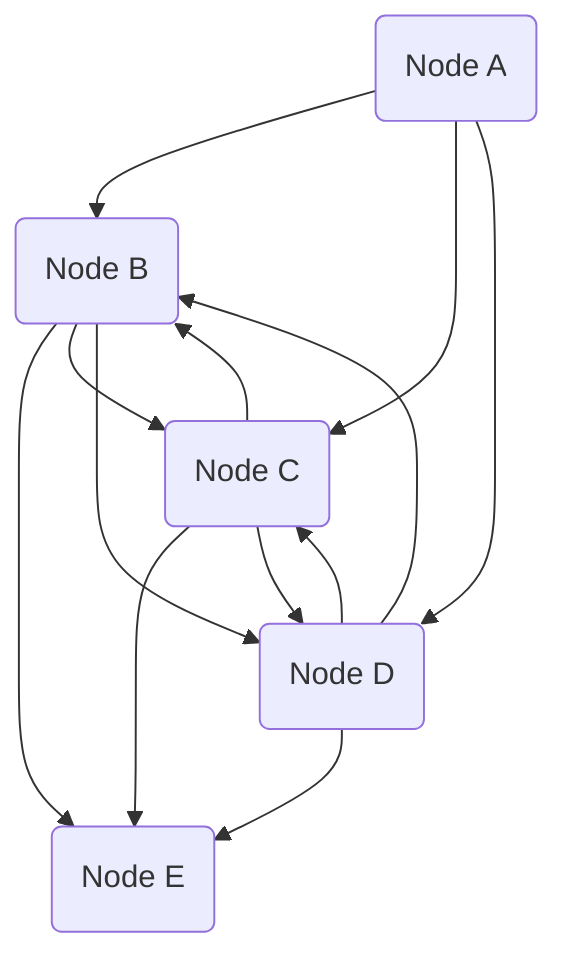

# {{title}}
## Synopsis
A short, one-paragraph summary that describes the events you know will happen or need to happen to move the plot forward, along with the opportunities and dangers that will be presented to the PCs.
## Graph

## Nodes
### A
### B
### C
### D
### E
## Timeline
- 1510/09/09: foobar
## NPCs
## Locations