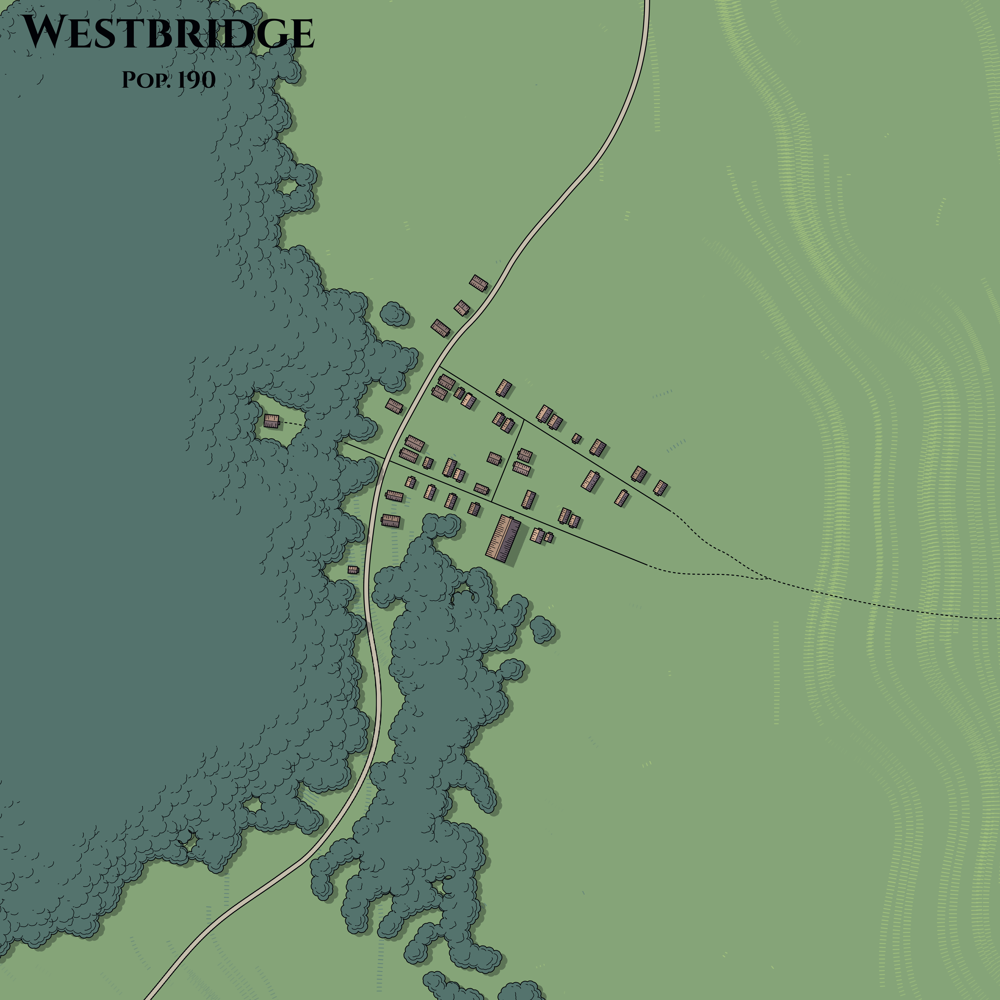

# Town of Westbridge

Type: Settlement

# Geography

The settlement is located at the intersection where the Long Road intersects with the Stone Trail.

# Features

Westbridge comprised a market, stockyard and a number of warehouses. As of the mid—14th century DR, they were all owned by the halfling businessman Ghaliver Longstocking.

# Locations

- Hammer and Nail: This wainwright shop was owned by Trystkin.
- Happy Halfling: Ghaliver's inn was quite cozy and relaxing.
- The Wemic Comes to Westbridge: This sunny, welcoming restaurant offered perfectly-prepared dishes.
- Westbridge Brewers: This winery produced middling wines but brewed particularly strong ale.
- Harvest Inn: This establishment was run by the likable art dealer Herivin Dardragon.