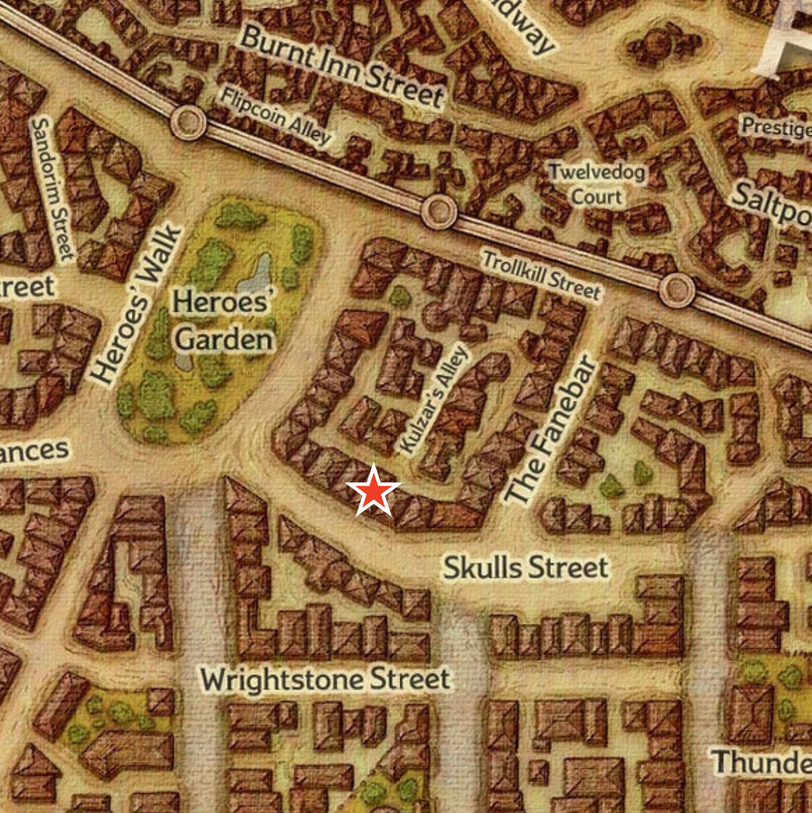

# Roarke House

Type: Residence

# Location

Waterdeep, Sea Ward. On Skull Street, aligned with Kulzar's Alley.

# Appearance

Massive three-story row house, obviously the largest and most well-kept on Skulls Street. Some of the older buildings in the vicinity have since been gentrified. Covered in moon, star, and eye iconography, particularly the ornately carved duskwood door, with a surface of relief-carved stars and crescent moons.

The interior has an echoing entry hall spanning all three floors, with a high ceiling and sweeping grand staircase hugging the walls of the room. It's lit by a massive glass skylight. Tiles cover the floor with moon and star patterns.

The property has many levels of cellars and subbasements connected to Waterdeep's dungeons, sewers, and beyond. Most date back centuries, leading to the crypts underneath Skulls Street for which it was named. The famed thief the Rook was said to have maintained a hideout there called the Rook's Hold.

# Background

Built by Volam Roarke, an exceedingly devout worshipper of Selune, who financed the restoration of Waterdeep's House of the Moon after the Spellplague collapsed it.

The Roarkes had attained noble status by the early 1400s DR, but their family fortunes eventually dried up around the same time. By the time they lost their status and wealth in the mid-1400s, patriarch Vers Never purchased all the family's holdings in the city. Their current holdings are reduced to two inns along the High Road.

Used as a summer rental for the nobility for many years by Dagult Neverember until the end of his tenure as Open Lord and departure for Neverwinter. Later converted into a safe house and base of operations by his son Renaer, for his group of friends the Moonstars.